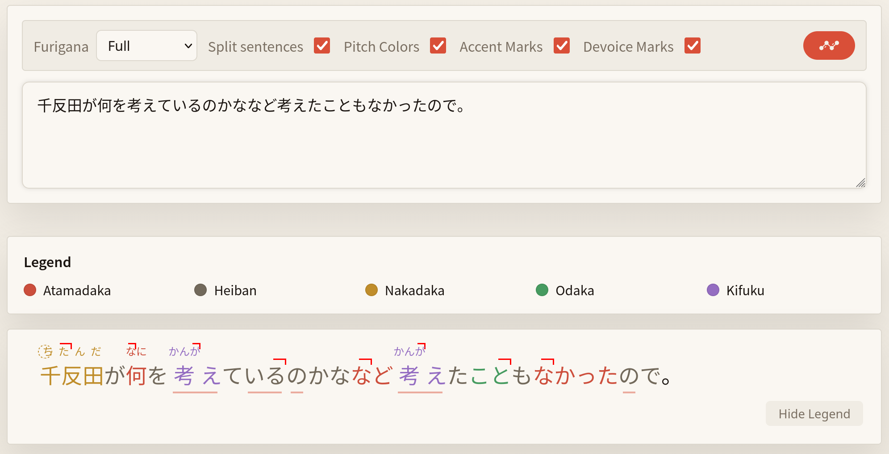

# The Invisible Layer of Fluency: Understanding Japanese Pitch Accent

Most learners spend years mastering grammar and vocabulary but eventually plateau. While grammar is written and visible, pitch accent, i.e. the high and low tones that give Japanese its natural rhythm, is usually invisible. 

If your goal is native-level fluency, relying entirely on expanding vocab or studying more grammar to cover up your incorrect pitch will not get you there. Here is how to finally understand the shape of words.

---

## The Four Core Pitch Patterns Explained

Standard Tokyo Japanese categorizes words into four distinct pitch accent patterns. The pitch drops (or doesn't) between morae (the rhythmic units/syllables of Japanese). 

### 1. 平板 (Heiban - Flat)
Starts low on the first mora, rises on the second, and stays high. The pitch **does not drop** when a particle (like が or は) is attached.
*   **Example:** 桜 (Sakura)
*   **Pitch flow:** sa(Low) ➔ ku(High) ➔ ra(High) ➔ ga(High)

### 2. 頭高 (Atamadaka - Head-high)
Starts high on the first mora, then immediately drops on the second mora and stays low. Attached particles remain low.
*   **Example:** 命 (Inochi)
*   **Pitch flow:** i(High) ➔ no(Low) ➔ chi(Low) ➔ ga(Low)

### 3. 中高 (Nakadaka - Middle-high)
Starts low, rises, and then drops somewhere in the middle of the word. Attached particles remain low.
*   **Example:** あなた (Anata)
*   **Pitch flow:** a(Low) ➔ na(High) ➔ ta(Low) ➔ ga(Low)

### 4. 尾高 (Odaka - Tail-high)
Starts low, rises, and stays high until the very end of the word. The pitch **drops immediately after** the word, forcing the attached particle low.
*   **Example:** 男 (Otoko)
*   **Pitch flow:** o(Low) ➔ to(High) ➔ ko(High) ➔ ga(Low)

### The Special Case for Verbs & i-Adjectives: Heiban vs. Kifuku

While nouns can fall into any of the four detailed patterns above, verbs and *i*-adjectives are actually much simpler. To conjugate them perfectly, you do not need to memorize four patterns. You only need to classify them into two binary categories: **Heiban** (unaccented) or **Kifuku** (accented).

*   **平板 (Heiban - Unaccented):** The word is flat and has no pitch drop. 
*   **起伏 (Kifuku - Accented):** Literally meaning "undulating" or "ups and downs," this is a catch-all category for any verb or *i*-adjective that contains a pitch drop (effectively grouping Atamadaka, Nakadaka, and Odaka into one bucket).

**Why this is the ultimate shortcut:**
Verb and *i*-adjective pitch rules during conjugation depend entirely on whether the base word is *Heiban* or *Kifuku*. 

If you know a verb is *Kifuku* (accented), you automatically know exactly where the pitch will drop in its *~te* form, past tense (*~ta* form), or negative (*~nai* form). You do not need to memorize the pitch of every single conjugation individually. Akusento recognizes this grammatical reality and categorizes verbs and adjectives accordingly, allowing you to learn the underlying rules rather than memorizing isolated forms.

---

## Why Dictionaries Are Not Enough (The Context Problem)

Looking up words in a standard dictionary is fine for flashcards, but Japanese isn't spoken in isolated words. Pitch accent is highly dynamic and context dependant. 

When a word is conjugated or attached to particles, the pitch often shifts. Standard dictionaries only show the isolated pitch accent of the base form of the word. To truly understand how a sentence sounds, you need context-aware parsing.

Take a complex sentence like:
> 千反田が何を考えているのかななど考えたこともなかったので。

A standard lookup tool will misread the pitch of these words because it doesn't understand grammar. Akusento utilizes MeCab and UniDic to analyze the full sentence structure, applying grammatical rules to accurately map pitch shifts across conjugations and particle attachments, compound words and much more:

*(Above: Akusento's visual engine rendering accurate mora-level pitch drops across a full sentence).*

---

## Frequently Asked Questions

### Do I really need to learn Japanese pitch accent?
Yes, if your goal is natural fluency. While Japanese is highly contextual, relying entirely on context to cover up incorrect pitch can make your speech sound unnatural or confusing to native speakers.

### What is the difference between pitch accent and intonation?
Pitch accent is the internal high/low sound structure of individual words, which determines meaning (e.g., *hashi* meaning bridge vs. chopsticks). Intonation is the rise and fall of the voice over an entire sentence to convey emotion, emphasis, or a question.

### How do I find the pitch accent of a whole sentence?
Standard dictionaries only show isolated words. To see how pitch changes within a sentence when particles and conjugations are added, you need a contextual parser like Akusento.
